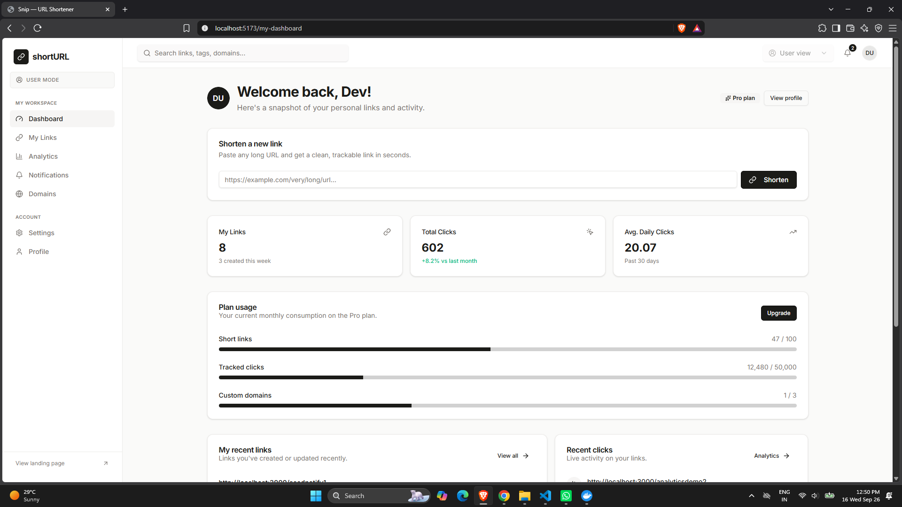

# URL Shortener

A production-grade bit.ly clone. Built to demonstrate the exact architecture decisions from the system design session.

## Screenshot


## Stack

| Layer | Tech | Why |
|---|---|---|
| API | Node.js + Express | Fast, non-blocking I/O |
| Cache | Redis 7 (LFU) | Removes 80%+ of DB read load |
| Database | PostgreSQL 16 | Primary (writes) + Replica (reads) |
| Proxy | Nginx | Load balancing, rate limiting |
| Container | Docker Compose | One command to run everything |

## Architecture Decisions (from the learning report)

**1. Base62 over MD5** — `src/utils/base62.js`
MD5 can produce the same first 7 chars for two different URLs (collision). Base62 encodes the auto-increment DB ID — unique by definition.

**2. Reads go to replica, never primary** — `src/config/database.js`
`queryRead()` → postgres-replica. `queryWrite()` → postgres-primary. Replica fails → falls back to primary automatically.

**3. Cache stampede protection** — `src/services/url.service.js`
When cache expires on a popular URL: mutex lock ensures only one request hits the DB. Others wait 200ms and get the freshly cached value.

**4. LFU eviction, not LRU** — `docker-compose.yml` Redis config
LFU keeps the most-frequently-visited URLs in RAM. LRU would evict a URL visited 10,000 times just because it wasn't visited in the last hour.

**5. Analytics are async** — `src/services/url.service.js`
Click recording runs in `setImmediate()`. The redirect HTTP response is sent before analytics write completes. Redirect latency is never affected by a slow DB write.

**6. No `updated_at` on short_urls** — `postgres/init/01_schema.sql`
Short URLs are write-once. An `updated_at` column would be dead weight on every row.

**7. Soft delete** — `is_active = false` instead of `DELETE`
Hard-deleting rows leaves gaps in auto-increment IDs and breaks analytics history.

## Quick Start

```bash
# 1. Clone and enter directory
git clone <repo> && cd url-shortener

# 2. Start everything (copies .env.example → .env automatically)
make up

# 3. Verify it's running
curl http://localhost/health
```

The API is available at `http://localhost/api/v1`.

## All Commands

```bash
make up              # Start all services
make down            # Stop all services
make restart         # Restart app only (after code changes)
make logs            # Tail all logs
make logs-app        # Tail app logs only
make shell           # Shell inside app container
make db-shell        # psql on primary DB
make redis-cli       # Redis CLI
make redis-flush     # Clear all cache (dev only)
make test            # Run test suite
make clean           # Remove everything including volumes
```

## API Reference

Import `postman_collection.json` into Postman for the full collection with auto-saving auth tokens.

### Auth

```
POST /api/v1/auth/register      Create account → returns JWT + API key
POST /api/v1/auth/login         Login → returns JWT + API key
GET  /api/v1/auth/me            Get current user
POST /api/v1/auth/api-key/rotate  Issue new API key
```

### URLs

```
POST   /api/v1/urls             Shorten a URL (guest or authenticated)
GET    /api/v1/urls             List my URLs (auth required)
DELETE /api/v1/urls/:code       Delete a URL (owner only)
```

### Redirect

```
GET /:code                      Redirect to original URL (the hot path)
```

### Analytics

```
GET /api/v1/analytics/dashboard          Account summary
GET /api/v1/analytics/urls/:code         Per-URL stats (daily, referers, countries)
```

### Auth methods

Both methods work on any authenticated endpoint:

```bash
# JWT
curl -H "Authorization: Bearer <token>" http://localhost/api/v1/urls

# API Key (header)
curl -H "X-API-Key: sk_xxxxx" http://localhost/api/v1/urls

# API Key (query param)
curl "http://localhost/api/v1/urls?api_key=sk_xxxxx"
```

## Project Structure

```
url-shortener/
├── src/
│   ├── config/
│   │   ├── database.js      # Primary + replica pools, queryRead/queryWrite
│   │   ├── redis.js         # LFU cache, mutex lock, cache helpers
│   │   └── logger.js        # Winston structured logging
│   ├── controllers/         # HTTP layer — request/response only
│   ├── services/            # Business logic — url.service, auth.service
│   ├── models/              # DB queries — user, url, analytics
│   ├── middleware/          # auth, rateLimit, error
│   ├── routes/              # Express routers
│   ├── utils/
│   │   ├── base62.js        # encode(id) → short code, decode(code) → id
│   │   └── validators.js    # Joi schemas
│   ├── app.js               # Express setup
│   └── index.js             # Server boot + graceful shutdown
├── postgres/
│   └── init/
│       ├── 01_schema.sql    # Tables, indexes (no updated_at on short_urls)
│       └── 02_seed.sql      # Dev seed data
├── nginx/
│   └── nginx.conf           # Upstream, rate limiting, proxy config
├── docker-compose.yml       # Full stack definition
├── Dockerfile               # Multi-stage, non-root user
├── Makefile                 # Dev commands
├── .env.example             # All config with comments
└── postman_collection.json  # Full API collection
```

## Scaling path (when you need it)

The code is already structured for this — no rewrites needed:

```
Today:       Cache → one DB (handled)
Next:        Read Replica (connection strings already split in database.js)
After that:  More read replicas (add to replicaPool config)
Last resort: Sharding (shard router goes between service and model layer)
```
